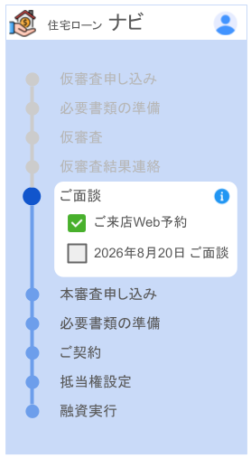

# 要求仕様

## 概要
アイデアソンで提案するスマホアプリのデザインモック。
住宅ローンの顧客が銀行に対して仮審査申し込みをしてから、融資実行までの間使うアプリ。

## このアプリでユーザーができること
- 融資実行までのフローが表示されている
    - 仮審査申込
    - 必要書類を準備する
    - 仮審査
    - 仮審査結果連絡
    - ご面談
    - 本審査申込
    - 必要書類を準備する
    - ご契約
    - 抵当権設定
    - 融資実行
- フローの中で、今自分がどのフェーズにいるかわかる
- 今自分がするべきことを開始するボタンやリンク **だけ** が表示されている
- フローの各フェーズについて説明を閲覧できる

## 画面ラフイメージ

## 動作環境
- スマホ、縦画面前提。他の画面は考えない。